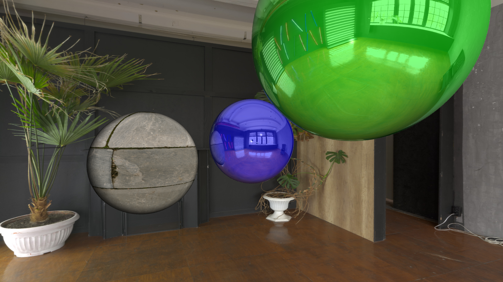

# Raytracer

A simple raytracer in C, with diffuse and specular lighting, reflections,
shadows, environment map, and a couple other features. Developed following
the tutorial
_["Understandable RayTracing in 256 lines of bare C++"](https://github.com/ssloy/tinyraytracer/wiki/Part-1:-understandable-raytracing)_
and
_["Ray Tracing in One Weekend"](https://raytracing.github.io/books/RayTracingInOneWeekend.html)_.


_(Converted from ppm to png.)_

## Building and Running

Currently, the program takes no arguments and outputs the image directly
to `stdout` (in PPM format).

```bash
$ git clone --recurse-submodules # required for the libs
$ make
$ ./raytracer >out.ppm # or ./raytracer | display
```

You can change the rendering parameters at `config.h`.

### Credits and License

Code is licensed under [GPLv2](COPYING). Other assets:

- `assets/tiles.png`: [https://polyhaven.com/a/large_grey_tiles](https://polyhaven.com/a/large_grey_tiles)
   by [Rob Tuytel](https://polyhaven.com/all?a=Rob%20Tuytel) (under [CC0](https://creativecommons.org/publicdomain/zero/1.0/))
- `assets/neon-studio.jpg`: [https://polyhaven.com/a/neon_photostudio](https://polyhaven.com/a/neon_photostudio)
   by [Sergej Majboroda](https://polyhaven.com/all?a=Sergej%20Majboroda) (under [CC0](https://creativecommons.org/publicdomain/zero/1.0/))


